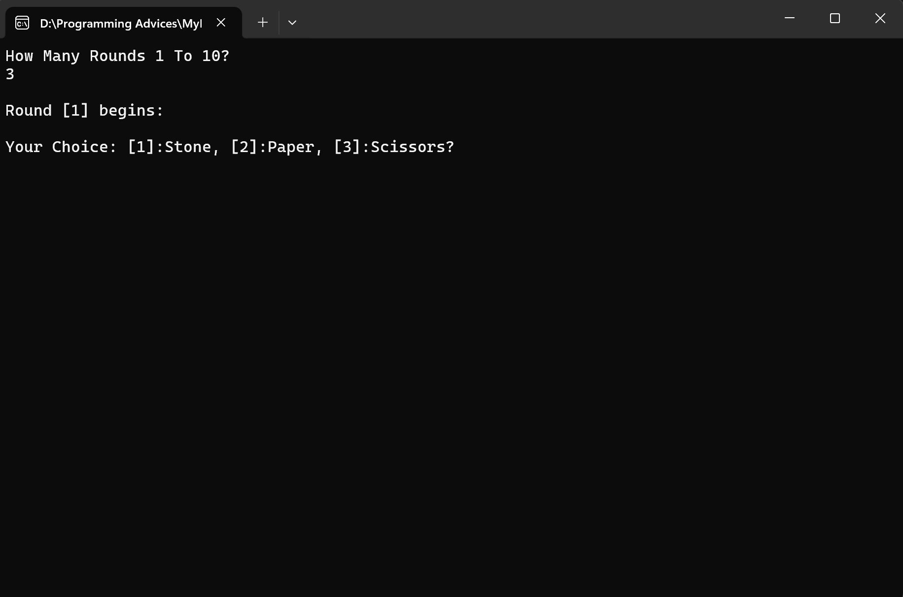
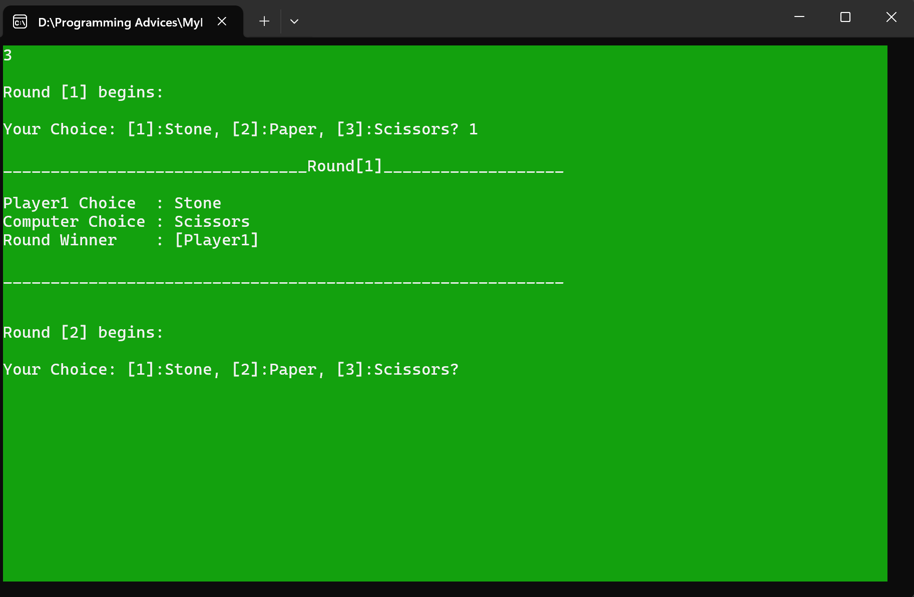
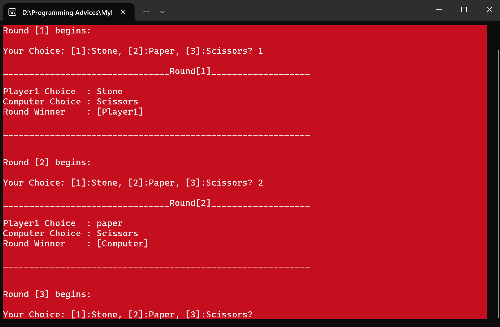
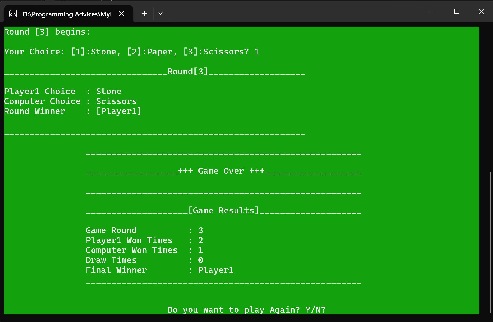

# 🪨📄✂️ Stone-Paper-Scissors Game (C++)

A fun and interactive console game built with modern C++ principles.  
It allows the user to play against the computer for a custom number of rounds (1 to 10).

---

## 🎯 Features
- Play Stone, Paper, or Scissors against the computer.
- Track wins, losses, and draws.
- Final result display with screen color change.
- Random choice generation for the computer.
- Structured code using enums and structs.
- Custom round selection (1 to 10).

---

## 🚀 How to Run
1. Open the project in Visual Studio.
2. Build and Run the project.
3. Follow on-screen instructions to play.

---

## 🛠️ Technologies Used
- C++
- Visual Studio
- Structs, Enums, Functions
- `system("color")` and `cls` for UI effects

---

## 💡 Planned Enhancements
✅ Add player name input  
✅ Score system with points  
✅ Save final results to a text file  
✅ Show all round history at the end  
✅ More expressive UI with emojis and better colors

---

## 📸 Screenshot
<div align="center">     </div>

---

## 🗂 Project Structure

```bash
Stone-Paper-Scissors/
├── images/
│   ├── Screenshot-1.png
│   ├── Screenshot-2.png
│   ├── Screenshot-3.png
│   └── Screenshot-4.png
├── .gitignore
├── README.md
├── RockPaperScissorsOriginal.cpp
├── RockPaperScissorsOriginal.sln
├── RockPaperScissorsOriginal.vcxproj
└── RockPaperScissorsOriginal.vcxproj.filters


---

## 👨‍💻 Author
KhalidSyntax